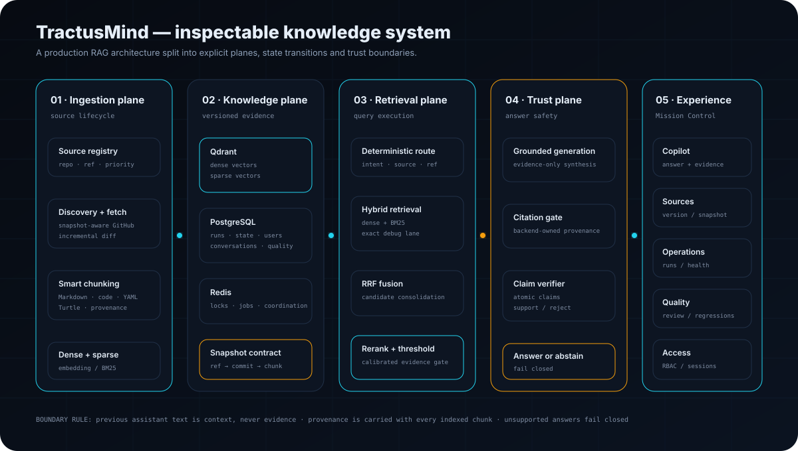
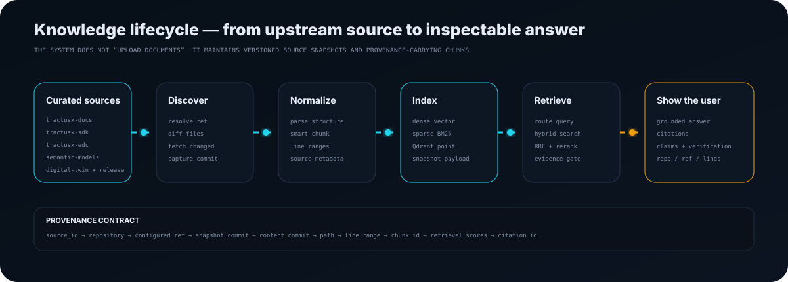
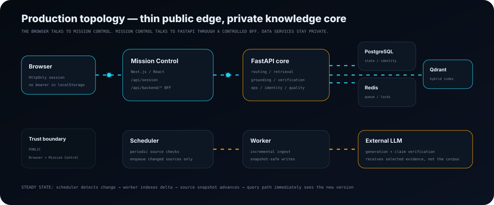

<div align="center">

# TractusMind

### An inspectable, source-grounded engineering intelligence system for Tractus-X

**Not a document-chat wrapper. A production knowledge system with explicit ingestion, retrieval, trust, operations and identity planes.**

<br/>


</div>

<p align="center">
  
</p>

TractusMind turns a curated set of Tractus-X repositories and documentation into a **versioned, queryable and inspectable knowledge system**. It maintains upstream source state, builds dense + sparse search representations, routes questions to the right source/version, verifies generated claims against retrieved evidence, and exposes the whole lifecycle through a Mission Control UI.

The interesting part is not the LLM call. The interesting part is the **system around it**: provenance, snapshot ownership, incremental synchronization, hybrid retrieval, fail-closed verification, identity boundaries, operational telemetry and human review.

---

## The architecture in one sentence

```text
curated upstream sources
    → versioned ingestion
    → provenance-carrying chunks
    → hybrid knowledge index
    → deterministic query routing
    → reranked evidence
    → grounded generation
    → citation + claim verification
    → answer OR abstention
    → inspectable Mission Control
```

### Five explicit planes

| Plane | Owns | Why it exists |
|---|---|---|
| **Ingestion plane** | discovery, diffing, fetch, parsing, chunking, embedding | source changes must become deterministic index changes |
| **Knowledge plane** | Qdrant, PostgreSQL, Redis, snapshot metadata | vector search alone is not enough; state and provenance need durable ownership |
| **Retrieval plane** | routing, filtering, dense/BM25, debug lane, RRF, reranking | different engineering questions require different evidence paths |
| **Trust plane** | grounding, citations, atomic claim verification, abstention | plausible text is not accepted as evidence-backed truth |
| **Experience / control plane** | Copilot, Sources, Operations, Quality, Access | users and operators need to inspect what the AI and the system actually did |

---

# 1. How the knowledge enters the system

<p align="center">
  
</p>

The corpus is not treated as a pile of uploaded documents. Every enabled source has a lifecycle.

The production corpus currently covers six curated Tractus-X source families:

```text
tractusx-docs
tractusx-sdk
tractusx-edc
digital-twin-registry
semantic-models
tractusx-release
```

Each registry entry carries the information needed to make ingestion reproducible: repository, configured ref, component identity, priority and current indexed snapshot.

## Source synchronization

For a normal production sync:

```text
Source Registry
   │
   ├─ resolve configured ref
   ├─ compare current manifest with previous snapshot
   ├─ discover added / modified / deleted / unchanged files
   ├─ fetch only what changed
   ├─ normalize + smart-chunk source content
   ├─ build dense and sparse representations
   ├─ upsert current points into Qdrant
   ├─ remove stale source-version points
   └─ atomically advance source state
```

The scheduler periodically checks source state. Work is handed to private workers through Redis/Dramatiq, with per-source locking preventing two synchronization runs from owning the same source at the same time.

### Why this matters

A conventional RAG prototype often has one operation: **“re-embed the documents.”**

TractusMind instead models ingestion as an incremental state transition:

```text
(previous manifest, upstream snapshot)
                ↓
           deterministic diff
                ↓
(add / modify / delete / unchanged)
                ↓
          new indexed snapshot
```

That makes the knowledge base observable, resumable and explainable.

---

# 2. The initial six-source GPU bootstrap

The first full corpus build was intentionally separated from the steady-state Railway runtime.

Large first-time embedding jobs are a poor use of always-on application compute, so TractusMind used a temporary **dual-GPU bootstrap worker** on a dedicated workstation.

```text
                    INITIAL BOOTSTRAP PATH

 six curated sources
        │
        ▼
 GitHub discovery + fetch
        │
        ▼
 production SmartChunker
        │
        ├────────── dense embedding ──────────┐
        │          GPU 0 + GPU 1              │
        │                                     ▼
        └────────── sparse BM25 ───────────► Qdrant
                                              │
                                              ▼
                                    local success bundle
                                              │
                                              ▼
                                trusted snapshot adoption API
                                              │
                                  ┌───────────┴────────────┐
                                  ▼                        ▼
                          PostgreSQL source state    Mission Control
```

The temporary bootstrap path reused the production source registry, chunking rules and Qdrant payload conventions. Only the expensive initial embedding/indexing execution moved outside Railway.

Once a source completed indexing, the bootstrap tool called an **ops-admin snapshot adoption endpoint**. The API validated the snapshot and indexed counts, reconciled the durable source manifest and marked the production run complete.

This creates an important architecture property:

> **Bootstrap compute is replaceable; the knowledge contract is not.**

The system does not care whether the first large embedding pass happened on Railway or a dedicated GPU box. Both paths must converge on the same source/snapshot/provenance model.

After bootstrap, the temporary worker is no longer part of the architecture. Railway scheduler + worker own incremental synchronization.

---

# 3. Provenance is a first-class data model

Every useful chunk must be able to answer: **where did you come from?**

The indexed payload carries enough metadata to connect a search result back to a reproducible source location:

```text
source_id
  → repository
  → configured ref / version ref
  → snapshot commit
  → content commit
  → file path
  → start / end line
  → chunk id
  → retrieval metadata
  → citation id
```

This provenance contract powers both answer verification and the UI evidence inspector.

### Core invariant

> Conversation history may provide context. It is never promoted into evidence.

Previous assistant responses cannot become citations. Explicit `ref:` and `commit:` constraints also fail closed when matching indexed provenance is unavailable.

---

# 4. Query execution is a pipeline, not a vector lookup

A user question passes through several deliberately separate stages:

```text
question
  │
  ├─ bounded owned conversation history, when eligible
  │
  ▼
query router
  │  intent · source families · version/ref/commit constraints
  ▼
filtered candidate retrieval
  │
  ├─ dense semantic search
  ├─ sparse BM25 search
  └─ exact/debug retrieval lane when applicable
  │
  ▼
RRF fusion
  │
  ▼
cross-encoder reranking
  │
  ▼
calibrated evidence threshold
  │
  ├──────── insufficient evidence ─────────► abstain
  │
  ▼
grounded generation
  │
  ▼
backend citation validation
  │
  ▼
atomic claim verification
  │
  ├──────── unsupported claims ─────────────► reject / abstain
  │
  ▼
grounded answer + evidence package
```

## Deterministic routing before retrieval

The router narrows the search space before expensive retrieval. It can constrain by:

- engineering intent,
- relevant source families,
- version / ref,
- exact commit when requested.

That is particularly important for a mixed corpus containing SDK code, EDC implementation, semantic models, release metadata and documentation. A single global similarity search is not enough.

## Hybrid retrieval

TractusMind combines multiple retrieval signals:

- **dense embeddings** for conceptual similarity,
- **BM25 / sparse retrieval** for exact terminology,
- **exact debug lane** for code/error-oriented questions,
- **Reciprocal Rank Fusion** for candidate consolidation,
- **cross-encoder reranking** for final evidence ordering.

The result is then compared with a calibrated evidence threshold before the LLM is allowed to answer.

---

# 5. The LLM is behind a trust boundary

Generation is not the final step.

The answer engine receives selected evidence and produces a candidate response. TractusMind then independently checks the structure around that output.

### Citation gate

Citations are backend-owned. Citation IDs returned to the user must resolve to evidence that actually came from retrieval.

### Atomic claim verification

The answer is decomposed into claims and checked against cited evidence. A verification report records supported/unsupported claims and the failure reason.

### Fail-closed behavior

If the system cannot establish enough support, it does not fill the gap with model confidence.

```text
GOOD EVIDENCE  → answer + citations + verification
WEAK EVIDENCE  → abstention
NO PROVENANCE  → abstention
BAD CITATIONS  → reject
```

This is why TractusMind can intentionally say:

> I don't have enough grounded Tractus-X evidence to answer this reliably.

That sentence is not a UX failure when evidence is actually insufficient. It is part of the trust contract.

---

# 6. How the user sees the system

Mission Control is designed as an **inspection surface**, not just a chat window.

## Copilot

The user gets the synthesized answer, but the interface also exposes the system state behind it:

- grounded / abstained state,
- evidence count,
- claim count,
- selected route,
- source families,
- model metadata,
- citations and provenance.

## Evidence Inspector

Evidence is navigable back to its engineering origin:

```text
repository
ref / version
snapshot commit
content commit
path
line range
retrieval / rerank / debug scores
```

The goal is simple: **an engineer should be able to challenge the answer without leaving the product.**

## Sources

The Sources surface exposes the knowledge registry itself:

- configured repository/ref,
- indexed snapshot,
- file count,
- latest run status,
- lock state,
- admin-triggered synchronization.

## Operations

The Operations surface exposes ingestion as a runtime process rather than a hidden batch job:

- running / succeeded / failed runs,
- discovered / fetched / chunk / indexed counts,
- per-source progress,
- errors,
- scheduler and core health.

## Quality

Failures and negative feedback can enter a human-reviewed quality loop. Reviewers classify root cause and may promote a case into the regression suite. Raw user feedback does not automatically rewrite production behavior.

## Access

Admin users can manage both human and machine identities:

- username/password human accounts,
- API-key identities,
- `user < operator < admin` RBAC,
- enable/disable,
- API key rotation,
- guarded account deletion.

---

# 7. Production runtime topology

<p align="center">
  
</p>

The desired public surface is intentionally thin.

```text
Internet
   │
   ▼
Mission Control / Next.js
   │
   │ controlled /api/backend/* BFF
   ▼
FastAPI core
   │
   ├── PostgreSQL
   ├── Redis
   ├── Qdrant
   └── external OpenAI-compatible LLM

Scheduler ──► Redis/Dramatiq ──► Worker ──► source/index state
```

The browser never needs direct database/vector-store access.

Mission Control exchanges username/password authentication for a **Secure HttpOnly session**. Browser backend calls go through the allowlisted Next.js BFF path instead of keeping a backend bearer credential in localStorage.

Production security includes:

- Secure `__Host-` session cookie,
- SameSite protection,
- cross-site mutation rejection,
- nonce CSP with `strict-dynamic`,
- optional OIDC Authorization Code + PKCE,
- backend JWT issuer/audience/signature validation,
- RBAC enforcement in the backend,
- private worker/scheduler/data services in the target topology.

See [`docs/mission-control.md`](docs/mission-control.md) and [`docs/railway-deployment.md`](docs/railway-deployment.md).

---

# 8. Control-plane state is separate from knowledge data

A useful system-design distinction in TractusMind is that **search data and operational truth are not the same thing**.

### Qdrant owns

- dense vectors,
- sparse vectors,
- searchable chunk payloads,
- current source/version evidence points.

### PostgreSQL owns

- source state,
- ingestion runs,
- conversations,
- answer interactions,
- feedback,
- quality review state,
- users / roles / auth metadata.

### Redis owns transient coordination

- background work,
- per-source locks,
- runtime coordination.

This separation prevents the vector database from becoming an accidental control database.

---

# 9. Failure modes were designed into the architecture

Real corpus runs changed the design. Several failure classes turned into durable engineering decisions.

| Failure observed | Architectural response |
|---|---|
| Python tree-sitter native crash | stdlib AST-based crash-safe Python chunking |
| Java parser crash risk | deterministic crash-safe Java chunking |
| legacy semantic-model text encoding | UTF-8 first with controlled CP1252 fallback |
| Turtle prefix / line provenance edge cases | streaming prefix context with valid line ranges |
| very large first corpus ingest | disposable external GPU bootstrap + trusted snapshot adoption |
| concurrent source synchronization | Redis source lock + explicit adoption conflict handling |
| stale/old source points | stale source-version deletion during index advance |
| LLM citation formatting drift | backend citation repair/validation before verification |
| unsupported generated claim | atomic verification + fail-closed answer policy |

The important pattern is that these are not hidden retries. They became explicit boundaries in the system.

---

# 10. Observability and operations

The backend exposes Prometheus/OpenTelemetry instrumentation and is designed to make expensive or unsafe stages visible.

Operational signals include:

- ingestion run state,
- source synchronization counts,
- local model latency,
- retrieval and reranking timing,
- answer grounding / verification outcomes,
- service health.

A dedicated CPU-only performance gate validates the local query model path with at most two CPUs.

Latest certified evidence recorded by the project:

```text
dense p95        51.4 ms   / budget 150 ms
sparse p95        0.32 ms  / budget 10 ms
reranker p95    944 ms     / budget 1650 ms
combined p95    990 ms     / budget 1750 ms
max RSS         893 MiB    / budget 1536 MiB
```

See [`docs/cpu-performance.md`](docs/cpu-performance.md).

---

# 11. System invariants

These rules describe the architecture better than a feature list:

1. **History is context, never evidence.**
2. **A citation must resolve to retrieved provenance.**
3. **Explicit version/ref/commit requests fail closed.**
4. **A source has one synchronization owner at a time.**
5. **The vector store is not the operational source of truth.**
6. **The browser does not keep backend bearer credentials.**
7. **Raw feedback cannot silently change production quality policy.**
8. **Insufficient evidence produces abstention, not improvisation.**
9. **Bootstrap infrastructure may be disposable; indexed snapshot semantics are durable.**
10. **Every major AI decision should be inspectable from Mission Control or telemetry.**

---

# 12. Technology map

| Layer | Technology |
|---|---|
| Mission Control | Next.js 16.3, React 19.2, Tailwind CSS 4.3, Motion |
| API / control plane | FastAPI, Pydantic |
| Durable state | PostgreSQL, SQLAlchemy, Alembic |
| Coordination | Redis, Dramatiq |
| Hybrid knowledge index | Qdrant |
| Dense / sparse retrieval | local embeddings + BM25 |
| Ranking | RRF + cross-encoder reranking |
| Generation / verification | OpenAI-compatible LLM API |
| Observability | Prometheus, OpenTelemetry, Grafana, Alertmanager |
| Production runtime | Railway |
| Containerization | Docker |
| Release/security | GitHub Actions, Trivy, GHCR, SBOM/provenance |

---

# 13. Repository map

```text
TractusMind/
├── app/                         FastAPI application
│   ├── api/                     answer, ops, auth, quality routes
│   ├── auth/                    identities, password/API/OIDC auth
│   ├── conversations/           persistent user conversations
│   ├── ingestion/               source synchronization pipeline
│   ├── retrieval/               Qdrant + hybrid retrieval
│   ├── state/                   source/run state
│   └── observability/           metrics + tracing
├── config/                      source registry and quality policy
├── frontend/                    Mission Control
├── migrations/                  PostgreSQL schema evolution
├── deploy/                      deployment configuration
├── docs/                        architecture / runbooks / release docs
└── scripts/                     calibration, validation, release tooling
```

---

# 14. Local development

Backend:

```bash
cp .env.example .env
docker compose up --build
```

Backend + Mission Control:

```bash
docker compose \
  -f docker-compose.yml \
  -f docker-compose.ui.yml \
  up --build
```

```text
Mission Control  http://localhost:3100
API              http://localhost:8000
OpenAPI          http://localhost:8000/docs
Grafana          http://localhost:3000
Prometheus       http://localhost:9090
Alertmanager     http://localhost:9093
Qdrant           http://localhost:6333/dashboard
```

---

# 15. Release engineering

The project includes production-oriented gates rather than treating deployment as a final manual step:

- backend/general CI,
- frontend production build/runtime/BFF/OIDC smoke,
- full-stack integration gate,
- Trivy repository and image scans,
- hardened HTTPS production-runtime gate,
- PostgreSQL backup/restore smoke,
- CPU performance budget gate,
- full-corpus validation/calibration workflow,
- release preflight,
- GHCR release images with SBOM/provenance.

The six-source corpus has been bootstrapped into production and normal synchronization is incremental. Remaining work is continued answer-quality calibration, operational hardening and release certification toward the final `v1.0.0` cut.

See:

- [`docs/full-corpus-validation.md`](docs/full-corpus-validation.md)
- [`docs/quality-gate.md`](docs/quality-gate.md)
- [`docs/release-checklist.md`](docs/release-checklist.md)
- [`docs/production-deployment.md`](docs/production-deployment.md)
- [`docs/railway-deployment.md`](docs/railway-deployment.md)

---

<div align="center">

## The design goal

### Make engineering knowledge searchable without making the AI opaque.

**Source state is visible. Retrieval is inspectable. Provenance survives indexing. Claims are verified. Operations are observable. Access is controlled.**

<br/>

`source → snapshot → chunk → evidence → claim → citation → user`

<br/>

Apache-2.0

</div>
